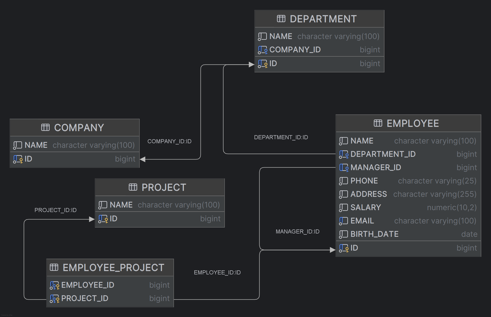

# MyBatis Example Project

Follow the steps below to set up and execute the project:

### 1. Database Tables

SQL script located at `src/main/resources/scripts/create_tables.sql` describes the relation structure of the database tables:



### 2. Run H2 Database in Server Mode
1. Execute the script to download the H2 database and start the server.
   ```bash
   mvn dependency:get -Dartifact=com.h2database:h2:2.3.232
   ```
2. Run the following command in the terminal to start the H2 database server:

```bash
java -cp "C:\Users\nika\.m2\repository\com\h2database\h2\2.3.232\h2-2.3.232.jar" org.h2.tools.Server -tcp -tcpAllowOthers -tcpPort 9092 -ifNotExists
```

then use the following connection string in your application:

```
jdbc:h2:tcp://localhost:9092/./companyDB;DB_CLOSE_DELAY=-1;AUTO_SERVER=TRUE;
```

or just use embedded mode for an open database file:

```bash
jdbc:h2:./companyDB;DB_CLOSE_DELAY=-1;AUTO_SERVER=TRUE;
```

### 3. Configure the Database

Update the database connection details in the `BaseConfig` class:
